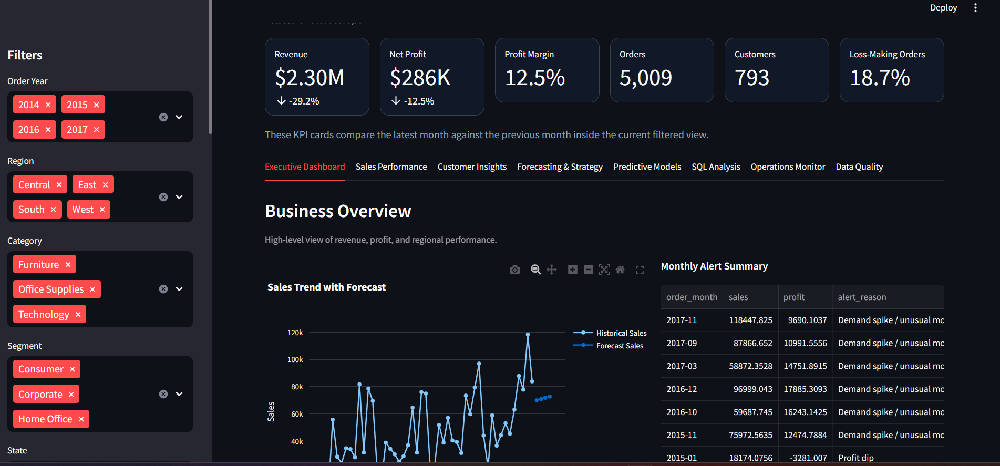
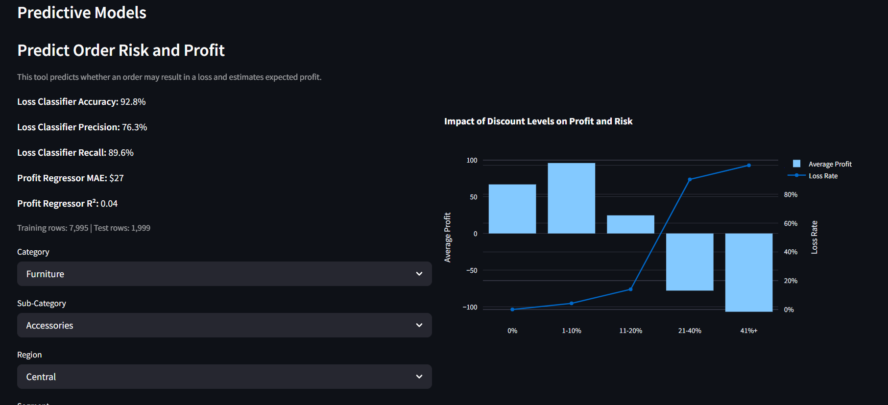
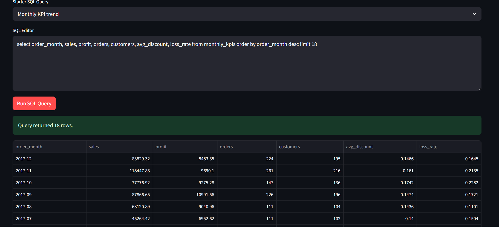
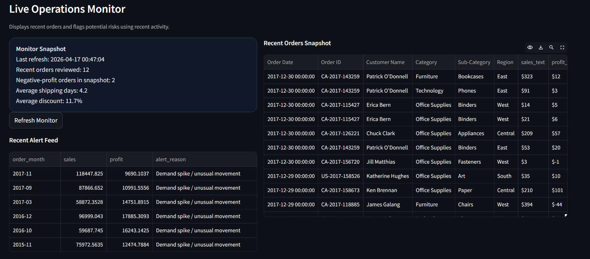

# Business Performance Analytics Dashboard

This project is an end-to-end business analytics dashboard built using the Superstore dataset. It combines SQL, data analysis, and machine learning to analyze sales performance, customer behavior, profitability, and operational trends.

---

## Overview

This project simulates a real-world analytics workflow. It provides an interactive dashboard where users can explore business data, run SQL queries, analyze customer segments, and use machine learning models to predict risk and profit.

The focus is on building a complete analytics pipeline, from data processing to insights and decision support.

---

## Key Features

Executive Dashboard
- KPI tracking (Revenue, Profit, Margin, Orders, Customers)
- Month-over-month performance comparison
- Regional and category insights

Sales Performance
- Sub-category profitability vs discount analysis
- Product opportunity identification
- State and regional breakdowns

Customer Insights
- Top customer analysis
- RFM segmentation (Recency, Frequency, Monetary)
- High-value customer identification

Forecasting and Strategy
- Sales and profit forecasting
- Discount scenario simulation
- Business planning insights

Predictive Models
- Loss risk classification model
- Profit prediction model
- Feature importance analysis
- Interactive prediction tool

SQL Analysis
- SQLite-based data storage
- Custom SQL query execution
- Predefined business queries

Operations Monitor
- Recent order tracking
- Risk detection for loss-making orders
- Operational metrics

Data Quality
- Data validation checks
- Business recommendations
- Export filtered dataset

---

## Tech Stack

- Python
- Pandas
- Streamlit
- Plotly
- SQLite
- Scikit-learn

---
## Screenshots

### Dashboard


### Predictive Models


### SQL Analysis


### Operations Monitor


---
```md
## Getting Started
python -m venv .venv
pip install -r requirements.txt
.venv\Scripts\Activate.ps1
python scripts/build_outputs.py
streamlit run app.py
